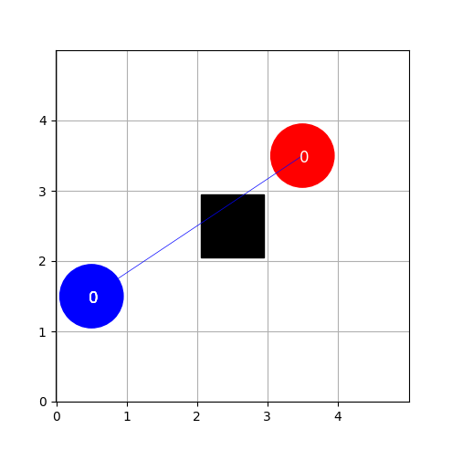

# Travaux fin d'étude
The goal of this repository is twofold:
1. It offers you an implementation of the environment that you should use for your experiments. Off course, you are free to adapt the behavior of the environment (e.g. by removing or adding the information passed in an observation, like communiations, or by changing the reward structure (reward shaping)).
1. It gives a couple of example implementations of single- and multi-agent reinforcement algorithms, adapted for the environment.

## The `Defense` Environment
The environment is a simple fully-observable multi-agent environment oriented towards defense applications. It contains $N_b$ blue agents and $N_r$ red agents. Agents on the same team (blue or red) have to work together to destroy the agents of the other team. They can do this by aiming and firing on other agents. If the opposing agent is close enough (within parameter `RANGE`), he wll be destroyed. Each agent can go left, right, up or down, and can aim or fire. A more rigourous describtion of the state- and action space is given below.  
A spefic instance of the environment can contain as many static landmarks can be created by generating a `.ter` text file in the `terrains` folder. Agents are represented by a `1` or `2` and landmarks by an `x`. Empty squares contain a dot. The size of the board is also defined by this text file. The image below represents a 7x7 board where each team has two agents and two landmarks are placed in the center of the board (see also `terrains/central_7x7_2v2.ter`):
```
                                    2.....2
                                    .......
                                    .......
                                    ..xxx..
                                    .......
                                    .......
                                    1.....1
```
The `defense_v0` environment is modelled as an `Agent Environment Cycle` (AEC) game - see [this article](https://arxiv.org/abs/2009.14471). The code snippet below gives he idiomatic game play, as proposed by the PettingZoo environment:
```python

    env = defense_v0.env(terrain='central_5x5')
    env.reset()
    for agent in env.agent_iter():
        obs, reward, done, info = env.last()
        action = actor(obs) if not done else None
        env.step(action)

```
where the `env.agent_iter()` method iterates over all alive agents. The current game state can be rendered with the `env.render()` method.  




### Game description
Every agent receives an observation that consists of:
1. An array that represents the true observation and that contains:
    1. the own state: position (x, y), alive status (0 or 1), remaining ammo and who he's aiming at (-1 if None)
    1. state information of the other agents on the same team
    1. state information of the agents on the other team
    1. the position (x, y) of the (unmovable) landmarks in the terrain
1. A boolean arry for the allowed actions in the current state. Only allwoed actions can be taken - otherwise, the environment throws an exception. Actions can be disallowed because:
    1. Attempting to move of the board or to already occupied position (by other agent or landmark)
    1. Firing when not aiming or no ammo left, or if there is no direct line of sight. Other agents or landmarks can block the line of sight; they can thus be used to hide behind.
    1. Any action when not alive

The size of the action space depends on the number of opponents. Every agent has 5 fixed actions at his disposal: `noop` (0), `left` (1), `right` (2), `up` (3),`down` (4) and  `fire` (5). Depending on the number of opponents, he can take $N_{r|b}$ additional aim actions: `aim0` (6 - aim at first opposing agent), `aim1`,  .... Actions are passed be using the action number as argument for `env.step()`.  

Rewards are given when:
1. a step is made: $R=-0.1$. This induces the agents to end the episode
1. when all opponents are destroyed: $R=1$ (or $R=-1$ for the losing team)

REMARK: the structure of the game is such that only live agents can still receive a reward at the end of the game. A dead agent thus never receives a reward, even if she has contributed to a potential win. For a correct analysis,
rewards should thus be evaluated on the team level.

## Algorithms
The `algorithms` folder contains a number of deep reinforcement learning algorithms (based on `PyTorch`):
1. DQN
1. REINFORCE (to do)
1. PPO (to do)
1. QMix (to do)

## References
1. Deep Q-Networks (DQN): [Playing Atari with Deep Reinforcement Learning](https://arxiv.org/abs/1312.5602v1)
1. [Proximal Policy Optimization Algorithms](https://arxiv.org/abs/1707.06347)
1. [QMIX: Monotonic Value Function Factorisation for Deep Multi-Agent Reinforcement Learning](https://arxiv.org/abs/1803.11485)
1. [PettingZoo: Gym for Multi-Agent Reinforcement Learning](https://arxiv.org/abs/2009.14471)
